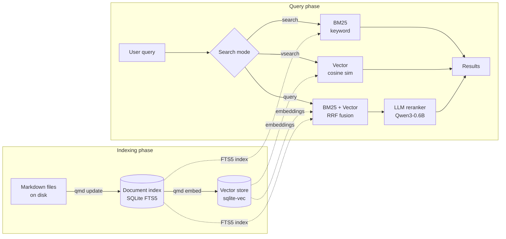

# qmd-dotnet

[](https://github.com/worndown/qmd-dotnet/releases)
[](https://dotnet.microsoft.com/download/dotnet/8.0)
[](https://www.nuget.org/packages/Qmd.Core)
[](LICENSE)

An unofficial .NET port of [qmd](https://github.com/tobi/qmd) by [Tobi Lutke](https://github.com/tobi) — a local search engine for markdown documents.

This is not a fork. It is written from scratch in C# and reproduces the functionality of the original TypeScript tool. **v1.0.0** matches qmd v2.1.0 functionality. Subsequent releases may diverge — this port evolves independently and there are no plans to track upstream changes.

**Windows only.** If you'd like to contribute Linux or macOS support, contributions are welcome.

---

## What is qmd good for?

### For end users — the CLI

qmd turns your local markdown files into a searchable knowledge base. Everything runs locally: the models, the index, and the search — no cloud services, no API keys, no data leaving your machine.

- Search personal notes, project wikis, or documentation using keyword or semantic queries
- Index files across multiple directories and search across all of them simultaneously
- Connect to AI assistants like Claude via a local MCP server, so they can retrieve from your documents
- GPU-accelerated via CUDA 12, with automatic CPU fallback

### For developers — the NuGet package

In addition to the CLI, this project publishes a NuGet package (`Qmd.Core`) that you can use to embed qmd's search capabilities directly into your .NET applications or services.

- `IQmdStore` provides a typed API for BM25, vector, and hybrid search
- Includes query expansion, LLM reranking, and collection management
- SQLite-backed — a single file, zero infrastructure

```bash
dotnet add package Qmd.Core
```

---

## Quick start

### 1. Download and install

Download `qmd-win-x64.zip` from [GitHub Releases](https://github.com/worndown/qmd-dotnet/releases), unzip it, and add the folder to your `PATH`.

Verify the install:
```bash
qmd --version
```

### 2. Pull models

```bash
qmd pull
```

Downloads the three local LLM models used for embeddings, reranking, and query expansion (~1.5 GB, cached — only needed once).

### 3. Create a collection

```bash
qmd collection add C:\path\to\my\notes --name notes
```

Scans the directory for `*.md` files and registers them in the index.

### 4. Add context (optional, but recommended)

```bash
qmd context add qmd://notes/ "Personal engineering notes and architecture decisions"
```

Context descriptions help the LLM components understand what each collection contains, improving search relevance.

### 5. Generate embeddings

```bash
qmd embed
```

Generates vector embeddings for all indexed documents. Required for `vsearch` and `query`.

### 6. Search

```bash
# Keyword search — fast, exact terms
qmd search "API versioning"

# Semantic search — finds by meaning
qmd vsearch "how to structure REST endpoints"

# Hybrid search — most accurate, uses LLM reranking
qmd query "consistency vs availability in distributed systems"
```

---

## How it works

qmd operates in two phases: an indexing phase that builds the search store, and a query phase that retrieves results.



- **`search`** — BM25 full-text search, fast, no models required
- **`vsearch`** — vector cosine similarity, finds results by meaning
- **`query`** — hybrid: BM25 + vector results merged via RRF, then ranked by an LLM reranker

---

## Features

- **Hybrid search** — BM25 full-text, vector semantic, and hybrid mode with reciprocal rank fusion
- **Local LLM inference** — [LLamaSharp](https://github.com/SciSharp/LLamaSharp) (llama.cpp) for embeddings, reranking, and query expansion
- **CUDA 12 and CPU** — GPU-accelerated with automatic CPU fallback
- **MCP server** — exposes search tools via Model Context Protocol for AI assistant integration (stdio and HTTP)
- **Multiple output formats** — CLI, JSON, CSV, Markdown, XML

---

## Documentation

- [Search Guide](docs/search-guide.md) — Choosing between search modes, output formats, and tuning `--min-score`
- [Command Reference](docs/commands.md) — Complete CLI reference for all commands and options
- [Calibrating Search Thresholds](docs/profile-embeddings.md) — Using `profile-embeddings` to find the right `--min-score` for your corpus
- [Hybrid Search Internals](docs/hybrid-search-guide.md) — RRF fusion, scoring, safeguards, benchmarking, and threshold calibration

---

## Prerequisites

- Windows 10/11
- CUDA 12 toolkit (optional, for GPU acceleration)

> The self-contained binary from GitHub Releases does not require .NET to be installed. If you are building from source, you will need the [.NET 8.0 SDK](https://dotnet.microsoft.com/download/dotnet/8.0) or later.

## Building

```bash
# Build
dotnet build Qmd.slnx -c Release

# Run tests
dotnet test Qmd.slnx -c Release

# Publish self-contained executable
dotnet publish src/Qmd.Cli/Qmd.Cli.csproj -c Release -r win-x64 --self-contained
```

The published output will be in `src/Qmd.Cli/bin/Release/net8.0/win-x64/publish/`.

---

## License

MIT — see [LICENSE](LICENSE) for details.

This project includes the original copyright notice from qmd.
